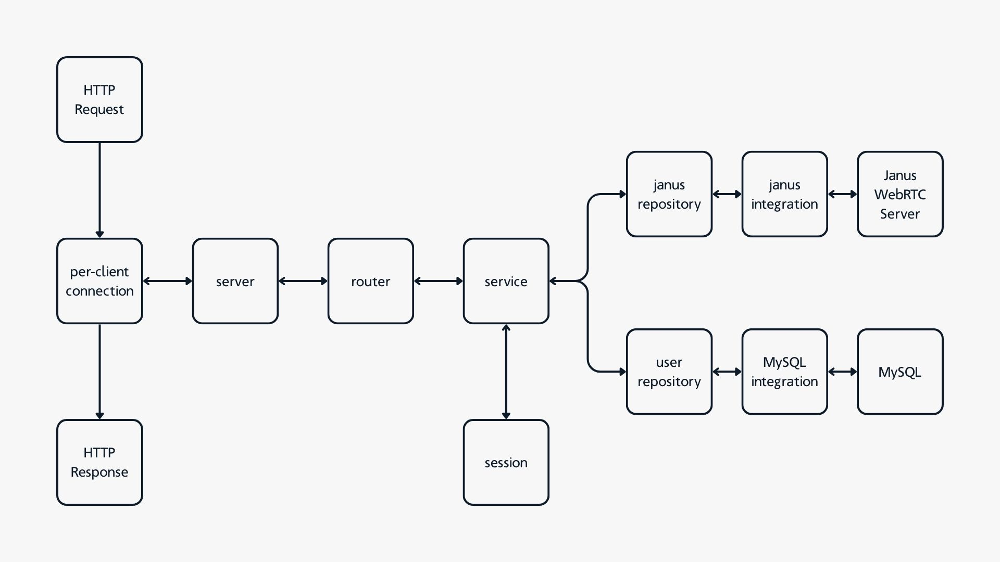

# LYNKS SAFE CONNECTIONS
This is the backend implementation for a Videomeeting software using a HTTP REST server, JanusWebRTC Server and a MySQL server. The whole project is Dockerized and ready to be launced.

## Core functionality
The project supports the following functionality:
* Logging in users using a token-based session structure.
* Routing incoming HTTP requests
* Initializing the Janus WebRTC Server VideoRoom plugin
* Many-to-one client to server connections with asynchronous functionality

## Goal of the project
The goal of this project was to create a MVP where a client can:
* Log in as an existing user.
* Use token-based logic instead of password.
* Create a new meeting.
* List all participants in meeting.

## Out of Scope functionalities
These haven't been applied because of the time frame. They might be implemented in the future, but not in a foreseeable one.
* Media handling in backend
* Authorization roles
* TLS / HTTPS

# Run the project
Follow the guide down below to be able to build this project:

## 1. Dependencies
The whole project is Dockerized with each repository containing a Dockerfile to create a containarable image. I highly recommend running this project through Docker to avoid too much complicated set-up when starting out.

---

### Docker

This project was build using `Docker version 29.1.2`. Visit Docker's website to download Docker Desktop.

https://www.docker.com/

---
### Client

To be able to utilize the backend and use the VideoRoom plugin, you need a Client-application which adheres to the
API provided in the [`Exposed API`](#exposed-api)-section.

I have also created a testclient which you can use: https://github.com/lafftale1999/lynks_testclient

---

### network_secrets.hpp
You need to create and populate `network/secret/network_secrets.hpp`. You can use the following template:

```cpp
#ifndef NETWORK_SECRETS_HPP_
#define NETWORK_SECRETS_HPP_

#define MYSQL_HOST      "mysql"
#define MYSQL_PORT      3306
#define MYSQL_USERNAME  "lynks_admin"
#define MYSQL_PASSWORD  "admin123"
#define MYSQL_DBNAME    "lynks_db"

#define JANUS_HOST      "janus"
#define JANUS_PORT      8088

#endif
```

## 2. Build and run
Run the following commands from the `root directory`, you can expect it to take a couple of minutes:

```sh
docker compose build --no-cache
```

```sh
docker compose up --force-recreate
```

## 3. Exposed API
Theses are the exposed API:s from the `network` server which houses the "business"-logic of this system.

---

### `host:port/login`
This accepts a json body containing the username and password. This will be checked against the `mysql` database and if the user doesn't exist - a bad request response will be sent back.

* **Expected method:** `POST`

* **Expected body:**
    ```json
    {"username": "testuser", "password": "test123"}
    ```

* **Expected response if succesful:**
    ```json
    {"action": "succesful", "token": "e313f4039db2bce74b02f108bc41ce19571a914dcb1d3c86ed4b90727ae0cb61"}
    ```

**Attention:** The token you received will be alive for 5 minutes as standard and renewed everytime you make a request. From now on it needs to be included in the `authorization`-header of the HTTP requests.

---
### `host:port/create`
This accepts an empty `json{}` as body. This is a session-based endpoint, which means you have to be logged in and received a token to be able to use it.

* **Expected method:** `POST`

* **Expected header:**
    ```json
    {"authorization": "e313f4039db2bce74b02f108bc41ce19571a914dcb1d3c86ed4b90727ae0cb61"}
    ```
    *This is only an example, if you haven't received a token - you need to `/login` first to receive one.*

* **Expected body:**
    ```json
    {}
    ```

* **Expected response if succesful:**
    ```json
    {"action": "success", "room_id": 123456}
    ```
    *For this project, I have assigned 123456 as the standard room to be created.*

---

### `host:port/list_participants`
Takes a `json{}` as body and uses the `room_id` to retrieve the current publishing participants in the meeting. This endpoint is mainly used for polling `publishers` that the `client` can subscribe to.

* **Expected method:** `POST`

* **Expected header:**
    ```json
    {"authorization": "e313f4039db2bce74b02f108bc41ce19571a914dcb1d3c86ed4b90727ae0cb61"}
    ```
    *This is only an example, if you haven't received a token - you need to `/login` first to receive one.*

* **Expected body:**
    ```json
    {"room_id": 123456}
    ```
    *This is only an example, the "room_id" here is not valid by standard and must be generated during the session by using `/create`*

* **Expected response if succesful:**
    ```json
    {
        "action": "success", 
        "room_id": 123456,
        "publishers": [1111, 2222, 3333]
    }
    ```
    *Notice that publishers are only represented as `integers`. This, together with the `room_id` is enough to subscribe to identify a `PeerConnection`*
---

## 4. Port Mapping
The following ports are set-up and exposed by default when you build the project using `docker compose`:

| Service   	| Internal  	| External  	| Protocol      |
|---    	    |---	        |---	        |---            |
|Janus   	    | 8088      	| 8088         	| TCP          	|
|Janus   	    | 8188      	| 8188         	| TCP          	|
|MySQL   	    | 3036      	| 3037         	| TCP          	|
|Lynks   	    | 60000      	| 60000       	| TCP          	|


# Repository Guide
In this project you will find three repositories: `janus_webrtc`, `mysql` and `network`. Down below you can find more in-depth information about each repository.

# Architecture


# Janus WebRTC REST API (VideoRoom-plugin) `/janus_webtrc`
This project uses Janus WebRTC Server as its real-time media backbone, specifically using the VideoRoom plugin to provide video meetings.

Janus acts as a lightweight WebRTC signaling and media routing server. In this project, only the VideoRoom plugin is used, which implements a Selective Forwarding Unit (SFU) based on a publish/subscribe model.

With VideoRoom, each participant can publish their own audio/video stream to a virtual room, while other participants selectively subscribe to available publishers. This architecture enables flexible meeting scenarios such as one-to-many sessions or fully interactive group calls, while keeping bandwidth usage efficient by forwarding media instead of mixing it server-side.

Each client establishes separate WebRTC PeerConnections for publishing and subscribing, allowing clean stream management and avoiding renegotiation issues. The backend interacts with Janus over its JSON-based API to create rooms, manage participants, and expose publisher information to clients, while all media exchange happens directly over WebRTC.

In this project, Janus is fully containerized and runs as an isolated service, making it easy to deploy, scale, and integrate with the REST API and MySQL-backed session logic.

https://janus-legacy.conf.meetecho.com/docs/

## MySQL `/mysql`
This project uses `MySQL 8.0` as a database. In the MVP we only store data for `users`.

The MySQL service runs as a dedicated Docker container and is automatically initialized on first startup using SQL scripts provided in the repository. These initialization scripts create the required database schema and seed any necessary base data, ensuring the backend is ready to use without manual setup.

### Seeding
The database is currently seeded with the following:
* New database -> `lynks_db`
* New admin -> 
    - `username = lynks_admin`
    - `password = admin123` *(very safe)*
* Table created -> `users:` 
    - `id` int auto_increment
    - `username` varchar(50)
    - `password` varchar(64)
* Seed table `users` -> 
    - `username = testuser`
    - `password = ecd71870d1963316a97e3ac3408c9835ad8cf0f3c1bc703527c30265534f75ae`
    
    *If you arent able to tell, it's its actually "test123" but hashed with SHA256*

### Persistence
The data is saved in Docker volumes, which means it is saved between runs. If for some reason, you want to re-seed your database you can run the following command:

```sh
docker compose down -v
```

---
# Network `/network`
The network repository contains all the networking necessary source-code for:
* Receiving and responding to HTTP request asynchronously
* Communication with the Janus WebRTC server
* Handle active sessions
* Sending queries to the MySQL database

### Namespaces

This contains two different important `namespaces`:
* `lynks::network` contains all the underlying network functionality and utilities.
* `janus` contains all the functionality for communication with the janus server.

---

## The `Janus` Namespace
The janus namespace provides a self-contained, asynchronous C++ client layer for interacting with the Janus WebRTC REST API, with a focus on the VideoRoom plugin.

---

#### `janus_common.hpp`
Common headers used in the `janus` namespace.

---

#### `janus_context.hpp`
Defines a high-level C++ client (`janus::janus`) for interacting with the Janus WebRTC REST API over HTTP. It owns an `asio::io_context` running on its own thread, handles session/plugin initialization (including VideoRoom setup), and implements Janus’s long-polling event loop via a dedicated TCP socket and response buffer. The class exposes async methods to start/stop the context, send one-off API requests (handling Janus ACK vs. deferred responses), and generates unique transaction/session identifiers to correlate requests and events.

---

#### `janus_messages.hpp`
This header defines a collection of strongly-typed C++ message wrappers for interacting with the Janus WebRTC REST API. It encapsulates the JSON request and response formats used when creating sessions, attaching plugins, maintaining keep-alive traffic, and interacting with the VideoRoom plugin.

The file is organized into logical namespaces (`session` and `video_room`) that mirror Janus’s API structure. Each class represents a single Janus message type and is responsible for either serializing C++ state into a valid Janus JSON request or parsing a raw JSON response into structured, accessible fields.

---

#### `janus_request_mapper.hpp`
This header defines a centralized request mapping and construction layer for Janus WebRTC HTTP API calls. It translates high-level `request_type` intents into fully-formed http_request objects with the correct method, headers, path and optional JSON body.

The request_mapper class acts as a static factory, using an internal map from request_type to request builder functions. This design cleanly separates what operation is being performed (e.g. create session, attach VideoRoom plugin, long-poll events) from how the corresponding HTTP request is constructed.

---

#### `janus_response_buffer.hpp`
This header defines `janus::response_buffer`, an asynchronous, coroutine-safe buffer used to coordinate responses received from Janus’s long-polling REST API with the requests that initiated them.

Janus may deliver responses asynchronously and out of order via long polling. `response_buffer` bridges this gap by buffering incoming `response_message` objects and allowing coroutines to `await` a specific response by transaction ID. Internally, it serializes access using an `asio::strand` and pairs waiting coroutines with timers to support bounded waiting and timeouts.

---

#### `janus_response_message.hpp`
This header defines `janus::response_message`, a lightweight value type representing a single event or response delivered by Janus via long polling.

The class encapsulates the essential fields needed to route and process Janus messages: the event type, transaction identifier and the associated JSON payload. It provides helpers for parsing raw JSON strings into structured data, serializing messages back to JSON and producing human-readable output for logging and debugging.

---

#### `janus_temporary_connection.hpp`
This header defines `janus::temporary_connection`, an abstraction for sending single HTTP requests to the Janus WebRTC REST API using asynchronous I/O.

Rather than maintaining a persistent connection, `temporary_connection` opens a TCP connection, sends a prepared http_request, reads the corresponding http_response and then shuts down cleanly. This pattern matches Janus’s REST interaction model for non–long-poll operations such as session creation, plugin attachment and room management.

The class exposes a single high-level static coroutine, `send_request`, which encapsulates DNS resolution, connection establishment, request transmission and response parsing.
 

## Janus API Current Architecture
The following functionality is supported in the current backend:

### Create room
To create a room the client need to follow this logic:
1. **Call `/create` as described in [`EXPOSED API`](#3-exposed-api)**
2. **Backend creates a Janus VideoRoom**
3. **Backend returns `room_id`**
4. **Client uses Janus WebRTC Server to connect to `room_id`**

### Subscribe to meeting participants
By joining a room, the client will not implicitly subscribe to all the `participants` media-feeds. Therefore, you can call explicitly for a list of the rooms participants and subscribe to their feeds.

1. **Call `/list_participants` as described in [`EXPOSED API`](#3-exposed-api)**
2. **Backend retrieves participants from Janus VideRoom**
3. **Backend returns a list of ids for the publishing `participants`**
4. **Client uses the list of ids to subscribe to their media-feed**
---

## The `Lynks Network` Namespace
The `lynks::network` namespace contains the full backend stack responsible for handling HTTP communication, authentication, persistence and integration with external services such as Janus WebRTC. It is structured into three layers: `Network`, `Repository` and `Service`.

## Network-layer
The network layer is responsible for transport, protocol handling, concurrency and session management. It exposes an asynchronous HTTP server built on `Boost.Asio/Beast` that manages client connections, routes incoming requests and provides the building blocks for higher layers.

---

#### `network_common.hpp`
Common headers used in the `lynks::network` namespace.

---

#### `network_connection.hpp`
Defines the `lynks::network::connection` class, which represents a single asynchronous TCP connection between the HTTP server and a client. It is responsible for managing the full lifetime of a client connection, including reading incoming HTTP requests, forwarding them into a shared request queue for processing, and serializing outgoing HTTP responses back to the client.

---

#### `network_crypto.hpp`
Defines small cryptographic and randomness utilities used by the networking layer. It provides a `hash256` function for hashing arbitrary strings into fixed-length 64-character values, which is suitable for identifiers and tokens and a templated `random_engine` constrained to integral types for generating pseudo-random numbers within a defined range. The random_engine also offers a higher-level `generate_token` helper that combines multiple random values and hashing steps to produce non-guessable tokens.

---

#### `network_lynks.hpp`
A convenience header for including the backend networking layer.

---

#### `network_message_handler.hpp`
Defines lightweight message wrapper-types used to pass HTTP requests and responses through the networking layer while preserving their ownership context. It introduces a generic `message_handle` for holding protocol data and an `owned_message_handle` that pairs a message with the client connection that produced it.

---

#### `network_mysql.hpp`
Defines `lynks::network::db_connection`, an asynchronous abstraction over a MySQL database connection pool built on Boost.MySQL.

---

#### `network_queue.hpp`
Defines a simple, templated, thread-safe queue used for passing messages between asynchronous components of the backend.

---

#### `network_router.hpp`
Defines the `lynks::network::router` class, which acts as the central HTTP request dispatcher for the backend. It inspects the incoming request path and routes each request to the appropriate handler.

---

#### `network_server.hpp`
Defines `lynks::network::server_interface`, the main entry point for running the backend HTTP server. It owns the `Boost.Asio io_context`, TCP acceptor and server thread. Sets up logic for accepting incoming client connections and manages their lifetime through connection objects. Incoming requests are pulled from a shared queue and handled asynchronously using coroutines, with each request routed through the router and its result sent back to the originating client.

---

#### `network_session_handler.hpp`
Defines `lynks::network::session_handler`, a thread-safe manager for active login sessions backed by a fixed-size container of `session_token` objects. It can create new sessions (issuing a 64-character token), validate tokens (and refresh their lifetime on use) and look up the associated username for an authenticated request. To keep the session set clean, it also runs a dedicated cleanup thread that periodically removes expired/inactive sessions and can be explicitly called via `clean_inactive_sessions()`.

---

#### `network_session_token.hpp`
Defines `lynks::network::session_token`, an object used to represent and track an individual authentication sessions. Each token binds a 64-character hash to an owner identifier (such as a username) and maintains a timestamp-based lifetime. This enables lookups with token to receive the owners `username` for example.

---

#### `network_user.hpp`
Defines `lynks::network::user`, a simple model representing a user within the backend system. The class supports construction from raw JSON input, plaintext credentials or fully populated database records, hashing passwords as needed during initialization.

## Repository-layer
The repository layer isolates data access and external system integration behind focused abstractions. It prevents higher-level logic from depending directly on database queries or third-party APIs.

---

#### `janus_repo.hpp`
Defines `lynks::network::janus_repository`, a thin integration layer between the backend and the Janus WebRTC integration. It owns a configured `janus::janus` context and exposes a small, focused set of coroutines for interacting with Janus, such as retrieving server information, creating VideoRoom meetings and listing room participants.

---

#### `user_repo.hpp`
Defines `lynks::network::user_repository`, a data-access abstraction responsible for retrieving user records from the database. It uses the shared `db_connection` to execute asynchronous queries and maps query results into models.

## Service-layer
The service layer contains application-level business logic. It orchestrates workflows across repositories and network utilities while remaining independent of transport and protocol details.

#### `user_service.hpp`
Defines `lynks::network::user_service`, the main service that coordinates user authentication and meeting-related operations. It sits between the HTTP router and lower-level repositories, combining database access, session management and Janus WebRTC interactions.

## Security
The `S` in Minimum Viable Product stands for *Security*. Since this is an MVP we are missing some important functionality for this actually be released in the wild. So for your information:
* Password hashing is SHA256 for MVP purposes (not production-ready)
* Tokens are short-lived and stored in memory
* Credentials and secrets are hardcoded for local development
* No HTTPS / TLS in this setup

# Quick Client Flow
Once the stack is running, the typical client flow looks like this:
* Login using `/login` to receive a short-lived `session_token`.
* Create a meeting using `/create` to receive a `room_id`.
* Join the VideoRoom by connecting your WebRTC client directly to Janus and joining `room_id`.
* Poll participants using `/list_participants` to discover active publishers and subscribe to their feeds.

# Help

## Known Bugs
* Connections ends with read request failed. This is because they are closed when finished sending the request - so the socket hit End of stream and closes, as it should. 

## Failure in building the Janus WebRTC Image
Some errors might be thrown while trying to build the `/janus_webrtc/Dockerfile`. One fix for this is to ensure that [`janus_webrtc/dependencies.sh`](./janus_webrtc/dependencies.sh) is in `LF`-format. Since Docker copies this from your computer into the image, it might be in `CRLF` format (Windows) and the `janus_webrtc`-image is based on `Alpine` (Linux).

## Docker fresh start
All the following commands must be made from the [`/root`](./) of the project.

* Stop all containers related to this project, deletes all volumes, removes all related images and all earlier related containers.
    ```sh
    docker compose down -v --rmi all --remove-orphans
    ```

* Flushes the cache used with `docker build`.
    ```sh
    docker builder prune -af
    ```

* Removes stopped containers, unused networks and dangling images. Removes all images that isn't used by a container.
    ```sh
    docker system prune -af --volumes
    ```

* Builds the images used in the [`./docker-compose.yaml`](docker-compose.yaml) file without using the cache.
    ```sh
    docker compose build --no-cache
    ```

* Starts all the services in the [`./docker-compose.yaml`](docker-compose.yaml) and forces to create new containers even if nothing have changes.
    ```sh
    docker compose up --force-recreate
    ```

# Finishing thoughts
This has been an incredibly fun project to work on. I have discovered the `Boost` library, which I have never used before and learned a lot more about coroutines and asynchronous programming. The goal for me was to learn more about C++, networking and creating a HTTP server. Further ahead I am also interested in trying to create a media-stream pipeline as well, but that is so far out of scope for this project.

